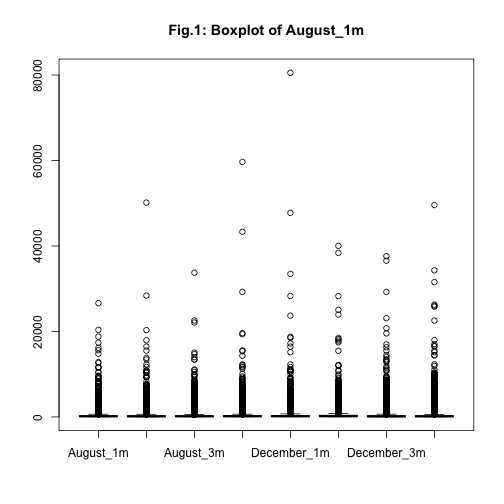
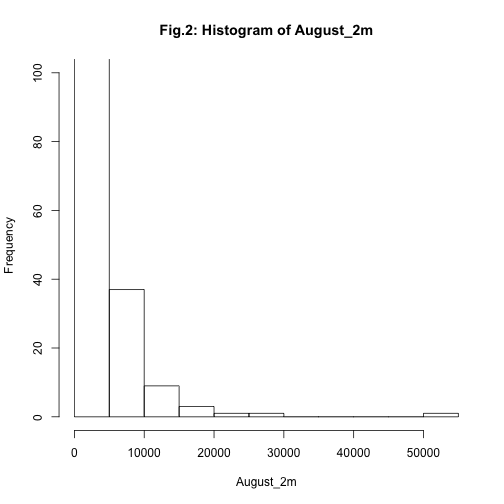
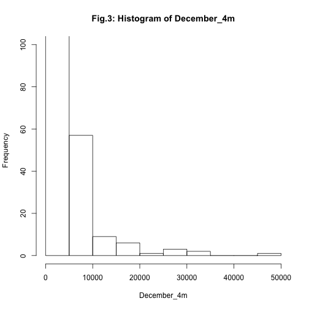

## Differential expression count data analysis
##### Author: Yassine Souilmi
##### Date: "December 16, 2015"

This is a report in response to the exercise designed by Dr. Boucas, and shared by Dr. Kornfeld ([*GitHub*](https://github.com/mpg-age-bioinformatics/exercise)).

For a fully automated run the scd.R script could be used:


```bash
./scd.R [input data]
```

The script will run automatically through the analysis, and return:

- A graphical preview of the data

- An analysis output tsv file

- An analysis summary tsv file with only the information of the individuals for which the levels of the malignant isoform (m) significantly changed from August to December independently of the changes in the gene(t).

*****
## Introduction
The input dataset is a tab-delimited file, where we have two groups of samples from the same individuals, August sampling and December's. For each group sampling was performed 4 times (replicates):
`August_1,August_2,August_3,August_4 ; December_1,December_2,December_3,December_4`.

Total counts(t) for a gene as well as counts for a malignant isoform (m) of the same gene are presented in the file. And Missing values in the raw data correspond to samples that got lost by the logistics partner.

#### Goal:
The goal of this exercise is to to identify individuals for which the levels of the malignant isoform (m) significantly changed from August to December independently of the changes in the gene(t).

*****
## Solution
### 1. Load the data:
The data contained a non-numeric value "inf" that had to be "removed" at the import.


```r
raw_data <- read.delim("~/bin/mpg_ex/mpg/raw_data.tsv", 
                       header = T, 
                       sep = "\t", 
                       dec = ".", 
                       fill = T, 
                       na.strings = c("inf"))
```

### 2. Explore and clean the data:
For better data manipulation, we will use the excellent "big-data" library dplyr [1].


Now that dplyr is loaded we can quickly sift through the data and explore it. Fist, we have to make sure that the imported data was imported in a dplyr compatible data frame.


```r
counts <- raw_data %>% as_data_frame()
head(counts)
```

```
## Source: local data frame [6 x 16]
## 
##   August_1m August_2m August_3m August_4m December_1m December_2m
## 1      8259      9281      7560      9134       12281       12099
## 2      3523      2934      2065      3273        2747        2211
## 3       757      1137       662       848        1332        1170
## 4       530       660       467       646          83         130
## 5       454       550       428       646         832        1474
## 6       795       953       623       646        1498        1517
## Variables not shown: December_3m (dbl), December_4m (dbl), August_1t
##   (dbl), August_2t (dbl), August_3t (dbl), August_4t (dbl), December_1t
##   (dbl), December_2t (dbl), December_3t (dbl), December_4t (dbl)
```
Since we are only interested in comparing malignant isoform (m) we will only keep the data related to it:

#### 2.1. Selecting only useful data:


```r
malignant <- counts[, 1:8]
```

#### 2.2. Exploring the data:

We check the content of the counts data frame, and collect information.


```r
malignant %>% head()
```

```
## Source: local data frame [6 x 8]
## 
##   August_1m August_2m August_3m August_4m December_1m December_2m
## 1      8259      9281      7560      9134       12281       12099
## 2      3523      2934      2065      3273        2747        2211
## 3       757      1137       662       848        1332        1170
## 4       530       660       467       646          83         130
## 5       454       550       428       646         832        1474
## 6       795       953       623       646        1498        1517
## Variables not shown: December_3m (dbl), December_4m (dbl)
```

```r
malignant %>% sapply(class) # get the class of each column
```

```
##   August_1m   August_2m   August_3m   August_4m December_1m December_2m 
##   "numeric"   "numeric"   "numeric"   "numeric"   "numeric"   "numeric" 
## December_3m December_4m 
##   "numeric"   "numeric"
```

```r
summary(rowSums(malignant)) # Get statistical summary "row-by-row"
```

```
##    Min. 1st Qu.  Median    Mean 3rd Qu.    Max.    NA's 
##     821    2390    3996    7647    7250  219700   19928
```


#### 2.3. Visuale exploration of the data:
We plot the data and look for any annomalise and out-layers.

 

### 3. Data cleaning and preparation:
Missing values (NAs) are replaced with '0's as they are incompatible with DGEList and edgeR libraries to be used downstream for the analysis.


```r
malignant[is.na(malignant)] <- 0
```

As no more information are available about the dataset origin or the technology used to generate it (RNA-Seq, ChIP-Seq or barcode counting), the high values in the data are not considered out-layers and will be included in the rest of the analysis.

### 4. Differencial count test:
As we can observe on the two example histograms below, the data have a multinomial distribution, that could be approached by the Poisson distribution. However, the big variations we are seeing in the data (Fig.1, 2 and 3) [2,4].

 

 

In the light of the evidence, the use of a negative binomial model to model the count data solves the over-dispersion issues [3]. The ***edgeR*** uses the same approach. It is worth noting that in our data each line represents an individual (patient), however, edgeR package was designed to have different genes on each line. This is without impact on the analysis and will deliver the needed results in our case.

#### 4.1. Loading the libraries:
The edgeR package expects a DESeq object that holds the dataset to be analysed by  and the subsequent calculations.


```r
source("https://bioconductor.org/biocLite.R") # make sure bioconductor is available
biocLite() # install core packages
biocLite("DESeq", "edgeR") # install libraries
library("DESeq", "edgeR") # load libraries
```

#### 4.2. Make a DGEList for edgeR:
##### 4.2.1. Define the groups
To make the DGEList object we need to first define our groups to compare:


```r
malignant_counts_groups = c(rep("August_m",4),rep("December_m",4))
```

##### 4.2.2. Create the DGEList object
Then create the actual DGEList object:


```r
malignant_DGEList = malignant %>% DGEList(group=malignant_counts_groups)
```

#### 4.3. Run edgeR analysis
Then we can run edgeR to compute the normalization factor, the common dispersion and the tag-specific weights (tagwise dispersion):


```r
malignant_DGEList = malignant_DGEList %>%
  calcNormFactors() %>%
  estimateCommonDisp(verbose=T) %>%
  estimateTagwiseDisp()
```
Then we can use the `exactTest()` function to compute the differences in the means between the two groups of the negative-binomially distributed counts.


```r
malignant_tgw = malignant_DGEList %>% exactTest()
```
Then we classify the differential expression (counts) as up and down or not-significant (1, -1, 0). The up and down represents in this case, the significantly over-expressed and under-expressed gene for the given individual.


```r
dt = decideTestsDGE(malignant_tgw, p.value=0.01)
```
We choose here a cutoff pvalue of 0.01, as demonstrated by Dalman in 2012 [5], the interpretation could be significantly altered by the chosen pvalue.

#### 4.4. Summarize the findings
As shown bellow, we have in this case 5 cases down, 4 up and 22079 non-significant.


```r
summary(dt)
```

```
##    [,1] 
## -1     5
## 0  22079
## 1      4
```
To better summarize out findings we are going to create two data frames, the first will include the computed statistics for all the individuals in the dataset. The second, will include only the individuals with significant changes for a quick access and sharing.

We will first use 'fdr' to adjust the pvalue using Benjamini & Hochberg (1995) ("BH" or its alias "fdr") method, this method is the default used and recommended by edgeR developers (used in the `decideTestsDGE()` function)


```r
PValue_fdr <- p.adjust(method="fdr",p=malignant_tgw$table$PValue)
```
Then we will combine all the useful results into a single data frame


```r
ind = c(paste("ind", 1:dim(malignant)[1], sep = '-'))
results = data.frame(ind, malignant_tgw$table,
                     "twd"=malignant_DGEList$tagwise.dispersion,
                     "PValue_fdr"=PValue_fdr,
                     "Decide_test"=dt,
                     malignant)
head(results)
```

```
##     ind      logFC    logCPM    PValue       twd PValue_fdr Decide_test
## 1 ind-1  0.1636164 11.674605 0.8389469 0.5991941          1           0
## 2 ind-2 -0.4143442  9.856255 0.6192570 0.6391602          1           0
## 3 ind-3  0.2583670  8.397585 0.7703755 0.7161338          1           0
## 4 ind-4 -2.9001424  6.882069 0.0111043 1.0190455          1           0
## 5 ind-5  0.8064250  8.003913 0.3811649 0.7650609          1           0
## 6 ind-6  0.7712607  8.530174 0.3826050 0.7077615          1           0
##   August_1m August_2m August_3m August_4m December_1m December_2m
## 1      8259      9281      7560      9134       12281       12099
## 2      3523      2934      2065      3273        2747        2211
## 3       757      1137       662       848        1332        1170
## 4       530       660       467       646          83         130
## 5       454       550       428       646         832        1474
## 6       795       953       623       646        1498        1517
##   December_3m December_4m
## 1       11091       12322
## 2        2354        3647
## 3        1433        1133
## 4         102          70
## 5        1160        1062
## 6        1331        2089
```
We can now generate a small summary data frame for ease of use and sharing:


```r
results_summary = results %>% filter(PValue_fdr<=0.01)
```

Then find the individuals for  which the levels of the malignant isoform (m) significantly increased from August to December, and the ones for which the levels of the malignant isoform (m) significantly decreased from August to December:


```r
results_summary
```

```
##        ind     logFC    logCPM       PValue      twd   PValue_fdr
## 1 ind-5674  15.01415  9.374906 7.049871e-08 2.062358 3.114351e-04
## 2 ind-6077 -11.52415  5.898586 2.710095e-06 1.868935 6.651176e-03
## 3 ind-6737  18.09089 12.450447 7.808231e-09 2.295355 5.748940e-05
## 4 ind-7220 -12.42235  6.789837 6.835227e-09 1.345429 5.748940e-05
## 5 ind-7597  12.96249  7.327526 6.547473e-10 1.255202 1.446206e-05
## 6 ind-7599 -13.97611  8.338259 3.859529e-07 2.110132 1.420821e-03
## 7 ind-7610 -11.73915  6.111499 9.744887e-07 1.758771 2.690563e-03
## 8 ind-7654  11.72878  6.101371 8.193336e-07 1.731080 2.585349e-03
## 9 ind-7767 -12.77818  7.143859 1.293445e-08 1.463317 7.142402e-05
##   Decide_test August_1m August_2m August_3m August_4m December_1m
## 1           1         0         0         0         0        6744
## 2          -1       454       330       311       202           0
## 3           1         0         0         0         0       80518
## 4          -1       568       513       740       606           0
## 5           1         0         0         0         0        1956
## 6          -1      1136      2714         0      3556           0
## 7          -1       530       476       194       323           0
## 8           1         0         0         0         0         541
## 9          -1       227       550       233      2263           0
##   December_2m December_3m December_4m
## 1           0        6791        4567
## 2           0           0           0
## 3       40028           0       34310
## 4           0           0           0
## 5         477         648        1310
## 6           0           0           0
## 7           0           0           0
## 8         433         375         531
## 9           0           0           0
```

#### Note: Comparable results could be found using a beta-binomial test, using for example the [ibb package](). The package crashed on my environment.

****
#### Write outputs to the disk and print session information:


```r
write.table(results, file="results.tsv", quote=F)
write.table(results_summary, file="results_summary.tsv", quote=F)
sessionInfo()
```

```
## R version 3.2.2 (2015-08-14)
## Platform: x86_64-apple-darwin13.4.0 (64-bit)
## Running under: OS X 10.11 (El Capitan)
## 
## locale:
## [1] en_US.UTF-8/en_US.UTF-8/en_US.UTF-8/C/en_US.UTF-8/en_US.UTF-8
## 
## attached base packages:
## [1] parallel  stats     graphics  grDevices utils     datasets  methods  
## [8] base     
## 
## other attached packages:
##  [1] knitr_1.11           ggplot2_1.0.1        reshape2_1.4.1      
##  [4] edgeR_3.12.0         limma_3.26.3         DESeq_1.22.0        
##  [7] lattice_0.20-33      locfit_1.5-9.1       Biobase_2.30.0      
## [10] BiocGenerics_0.16.1  ggvis_0.4.2          dplyr_0.4.2         
## [13] BiocInstaller_1.20.1
## 
## loaded via a namespace (and not attached):
##  [1] Rcpp_0.12.0          highr_0.5            formatR_1.2         
##  [4] RColorBrewer_1.1-2   plyr_1.8.3           tools_3.2.2         
##  [7] digest_0.6.8         evaluate_0.7.2       gtable_0.1.2        
## [10] annotate_1.48.0      RSQLite_1.0.0        shiny_0.12.2        
## [13] DBI_0.3.1            yaml_2.1.13          proto_0.3-10        
## [16] genefilter_1.52.0    stringr_1.0.0        S4Vectors_0.8.5     
## [19] IRanges_2.4.6        stats4_3.2.2         grid_3.2.2          
## [22] R6_2.1.1             AnnotationDbi_1.32.2 XML_3.98-1.3        
## [25] survival_2.38-3      rmarkdown_0.7        geneplotter_1.48.0  
## [28] magrittr_1.5         MASS_7.3-43          scales_0.3.0        
## [31] htmltools_0.2.6      splines_3.2.2        rsconnect_0.4.1.4   
## [34] assertthat_0.1       colorspace_1.2-6     mime_0.3            
## [37] xtable_1.7-4         httpuv_1.3.3         stringi_0.5-5       
## [40] munsell_0.4.2        lazyeval_0.1.10      markdown_0.7.7
```

****
### References:
1.	Wickham H, Romain F. dplyr: a grammar of data manipulation. R package version 0.2. 2014.

2.	Marioni JC, Mason CE, Mane SM, Stephens M, Gilad Y. RNA-seq: an assessment of technical reproducibility and comparison with gene expression arrays. Genome research. Cold Spring Harbor Lab; 2008 Sep;18(9):1509–17.

3.	Anders S, Huber W. Differential expression analysis for sequence count data. Genome Biol. 2010. 

4.	Robinson MD, McCarthy DJ, Smyth GK. edgeR: a Bioconductor package for differential expression analysis of digital gene expression data. Bioinformatics. 2010 Jan 1;26(1):139-40.

5.	Dalman MR, Deeter A, Nimishakavi G, Duan Z-H. Fold change and p-value cutoffs significantly alter microarray interpretations. BMC Bioinformatics. 2012;13(Suppl 2):S11. 
